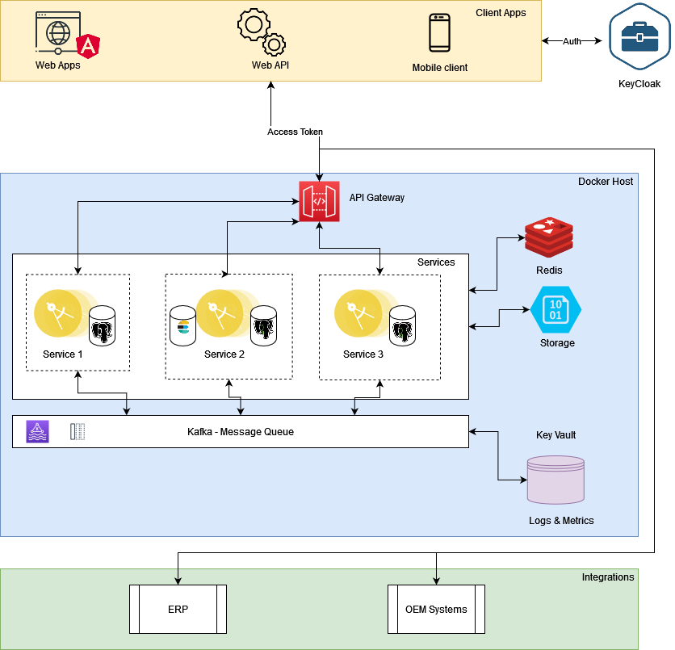

# CarAuto

Automotive solution based on microservice architecture

## Architecture

- [Keycloack](https://www.keycloak.org/): Identity and access management
- [Redis](https://redis.io/): In memory data store for caching
- Storage: Either the [Postgres](https://www.postgresql.org/) or the [MongoDb](https://www.mongodb.com/) will be used based on the needs of the application
- [Serilog](https://serilog.net/): Logging library which will log messages to Kafka
- [Kafka](https://kafka.apache.org/): Distributed event streaming platform
- [Api Gateway](https://konghq.com/): Kong will be used as the reverse proxy for the entire application ecosystem.
- [ERP](https://dynamics.microsoft.com/el-gr/business-central/overview/): The ERP will manage the orders/invoicing process
- [Frontend](https://learn.microsoft.com/en-us/dotnet/maui/what-is-maui?view=net-maui-7.0): MAUI will be the library which will be used to create the mobile and windows application frontend modules.
- [SignalR](https://dotnet.microsoft.com/en-us/apps/aspnet/signalr): It will be used to propagate messages to the UI.

## Description
- The administrator of the ecosystem will be able to create users in the Keycloak environment and those users will also be stored in the a separate microservice.
- A user will be also be able to create manually an account.
The actions and the services that each user will be able to use will be determined based on the role of the user.
- The user then will be able to browse the application and create Quotes for Vehicle purchases or Vehicle Service purchases.
- After the acceptance of the Quote from an employee the Quote will be converted to an order inside the system.
- As soon as the Order is fullfiled it will go through the invoicing process.
- The Quote/Order/Invoice will go through the microservice ecosystem and the ERP.
- As a final result the invoice will be delivered to the end user through e-mail or directly into the application.
